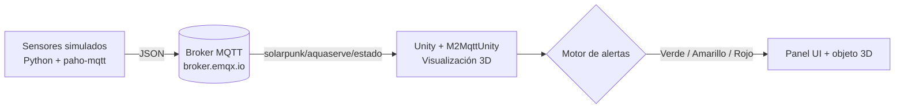

# AquaServe, Gemelo Digital de Enfriamiento Líquido con Captación Pluvial


Con AquaServe me metí en un reto grande: usar el agua de la lluvia para dos cosas a la vez, generar electricidad y enfriar servidores de IA. Es un gemelo digital de un sistema que capta agua pluvial, la pasa por microturbinas y la usa en enfriamiento líquido directo (DLC). Yo simulo la presión, el caudal, el nivel del depósito y la turbidez, y todo se ve en Unity con alertas automáticas por colores.

> _Aquí voy a poner una captura o GIF del gemelo funcionando (dejaré la imagen en `assets/` y la enlazo)._

## Problema que resuelve

La verdad es que los centros de datos de IA se toman muchísima agua y energía solo en enfriarse. Lo que quise mostrar con este proyecto es un gemelo digital que vigila en tiempo real un sistema de captación pluvial más enfriamiento líquido, y que me avisa solito cuando el caudal está crítico o el depósito está bajo; que son justo las condiciones que dejarían a los servidores sin refrigeración.

## Tecnologías

- **Python 3.11+** con `paho-mqtt`, que es donde vive mi simulador de sensores.
- **MQTT** (broker público `broker.emqx.io`), que transporta todo en **JSON**.
- **Unity** (C#) con **M2MqttUnity** para la visualización 3D en tiempo real.

## Arquitectura



## Cómo ejecutar

### 1. Simulador Python

```bash
cd 01_simulador_python
pip install -r requirements.txt
python simulador_aquaserve.py
```

### 2. Visualización en Unity

Crea una escena en Unity, agrégale el paquete M2MqttUnity y engancha el script principal a un objeto vacío para conectarte al broker MQTT. El script principal lo tienes en [02_unity_visualizacion/Scripts/VisualizadorAquaServe.cs](02_unity_visualizacion/Scripts/VisualizadorAquaServe.cs).

> **Nota:** en este momento estoy terminando por completo los modelos 3D y la interfaz, así que la escena visual todavía está en proceso. Por ahora comparto el simulador, el script de Unity y el caso de estudio; el proyecto Unity completo lo publicaré cuando lo tenga listo.

## Estructura del proyecto

```
Proyecto_2_AquaServe/
├── 01_simulador_python/
├── 02_unity_visualizacion/
├── 03_documentacion/
└── README.md
```

## KPIs y variables monitoreadas

Estas son las variables que sigo y lo que dispara cada alerta:

| Variable | Rango normal | Alerta |
|---|---|---|
| Presión | ≥ 30 PSI | Amarillo si menor |
| Caudal | ≥ 1 L/min | Rojo si menor |
| Nivel de tanque | ≥ 20 % | Rojo si menor |
| Turbidez | 0.2-0.9 NTU | Ninguna |

## Roadmap

Lo que quiero mejorar más adelante:

- [ ] Cambiar el broker público por uno propio (Mosquitto/EMQX self-hosted) con TLS.
- [ ] Guardar las series temporales (InfluxDB) y montar un dashboard en Grafana.
- [ ] Modelar el sistema de captación y el DLC en low-poly, en vez de primitivas.
- [ ] Sacar un build WebGL para tener la demo en vivo con GitHub Pages.
- [ ] Conectar sensores físicos reales (ESP32) en lugar del simulador.

## Enlaces

- Video demo: *(voy a agregar el enlace de YouTube cuando lo grabe)*
- Caso de estudio: [03_documentacion/caso_de_estudio.md](03_documentacion/caso_de_estudio.md)
- LinkedIn: [Juan David Camelo Zárate](https://www.linkedin.com/in/juan-david-camelo-zarate-75a000421/)

## Autor

Soy Juan David Camelo Zárate, estudiante de Ingeniería Multimedia en la UNAD, apasionado por los gemelos digitales.
